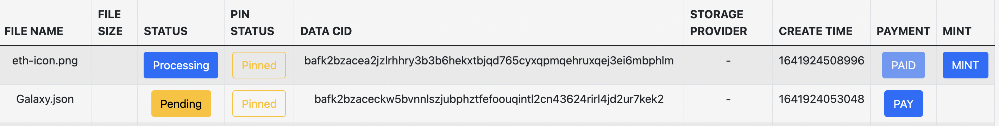
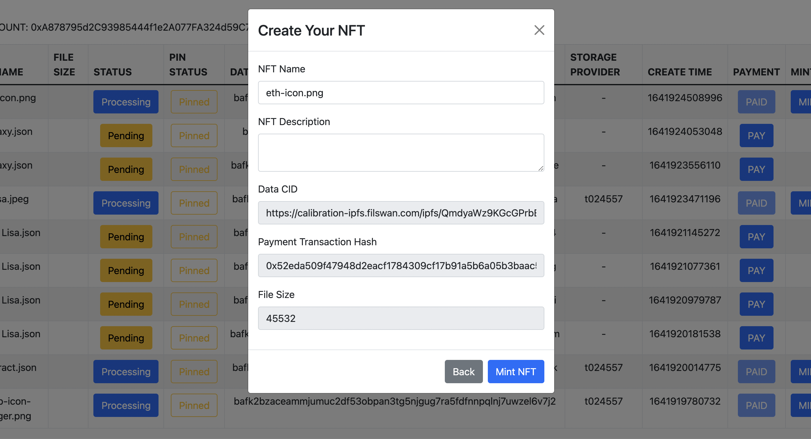
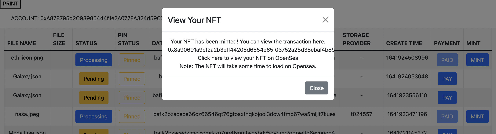

This is a [Next.js](https://nextjs.org/) project bootstrapped with [`create-next-app`](https://github.com/vercel/next.js/tree/canary/packages/create-next-app).

## Prerequisites

This project was coded using Node version 17.3.0. \
If you do not already have node installed, [Download and install node](https://nodejs.org/en/download/).

## Getting Started

First, install the dependancies, then run the development server:

```bash
npm install
npm run dev
```

Open [http://localhost:3000](http://localhost:3000) with your browser to see the result.

## Environment Variables
- `MCP_API`: the api endpoint
- `NFT_CONTRACT`: the address of the nft contract


## How it works

1. Create Web3 Instance. Connect your Metamask wallet.
2. Call MCP `storage/task/deals?wallet_address=` API to display uploaded
   files. (already done)
3. Use Web3 instance to connect to NFT contract \
   `new web3.eth.Contract(abi, contract_address, {from: user_address, gas: 9999999 })`
4. Files that have payment will also have mint button \
   
5. When you click the MINT button: Call `prepNft()` function
   1. Create nft object template: \
      To get ipfs_url and tx_hash you may need the
      `storage/deal/detail/` API and \
      the `billing/deal/lockpayment/info` API
   ```
   {
   name: <file_name>,
   description: '',
   image: <ipfs_url>,
   tx_hash: <tx_hash>,
   attributes: [{ trait_type: 'Size', value: <file_size> }],
   }
   ```
   2. Then Modal should appear for the user to edit the name and description, updates here \
      should also update the nft object.\
      
6. When the user clicked the 'Mint NFT' button in this model: Call `handleMint()`
   1. Show Loading screen..
   2. Upload the nft object to MCP as JSON file
   3. This upload should have `ipfs_url` in the response
   4. Send `mintData(user_Address, ipfs_url)` from the smart contract 
   ```
   const tx = await nftContract.methods
     .mintData(address, nftUrl)
     .send()
   ``` 
   5. This should trigger Metamask on the UI for approval.
   5. store the transaction hash `tx.transaction_hash`
   6. store the nft token id by calling `totalSuppy()`
   ```
   const tokenID = await nftContract.methods.totalSupply().call()
   ```
   7. Now the Modal should close and open another Modal
7. This modal should show the transaction hash, link to mumbai polygonscan, and link to opensea \
   `https://testnets.opensea.io/assets/mumbai/<CONTRACT_ADDRESS>/<TOKEN_ID>`\
    

## Extra Resources

To learn more about Next.js, take a look at the following resources:

- [Next.js Documentation](https://nextjs.org/docs) - learn about Next.js features and API.
- [Learn Next.js](https://nextjs.org/learn) - an interactive Next.js tutorial.
- [Web3 API Documentation](https://web3js.readthedocs.io/en/v1.5.2/) - learn about Web3 API.

You can check out [the Next.js GitHub repository](https://github.com/vercel/next.js/) - your feedback and contributions are welcome!
